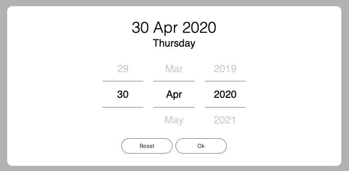
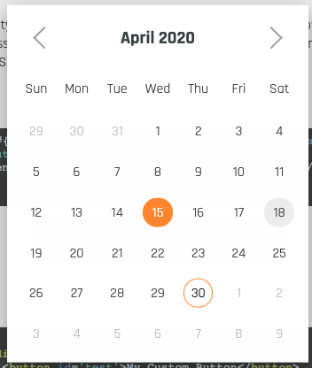
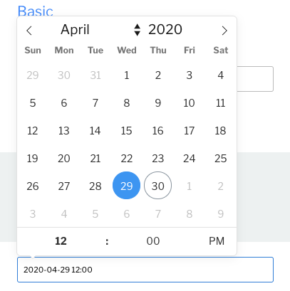

# 日期套件

## Svelte 日期套件

### svelte-touch-datepicker

*Demo*

*Link*

* [svelte-touch-datepicker - npm](https://www.npmjs.com/package/svelte-touch-datepicker)
    * [svelte-touch-datepicker Demo](http://sharifahmed.me/svelte-touch-datepicker/)

### svelte-calendar

*Demo*

*Link*

* [GitHub - 6eDesign/svelte-calendar: A lightweight datepicker with neat animations and a unique UX.](https://github.com/6eDesign/svelte-calendar)
    * [SvelteCalendar Demo](https://6edesign.github.io/svelte-calendar/)

### flatpickr

*Demo*

*Link*

* [jacobmischka/svelte-flatpickr: Flatpickr component for svelte](https://github.com/jacobmischka/svelte-flatpickr)
    * [flatpickr/flatpickr: lightweight, powerful javascript datetimepicker with no dependencies](https://github.com/flatpickr/flatpickr)
    * [Examples - flatpickr](https://flatpickr.js.org/examples/)

## 其他共用套件
* [GitHub - iamkun/dayjs: ⏰ Day.js 2KB immutable date library alternative to Moment.js with the same modern API](https://github.com/iamkun/dayjs)
    * [Format · Day.js](https://day.js.org/docs/en/display/format)